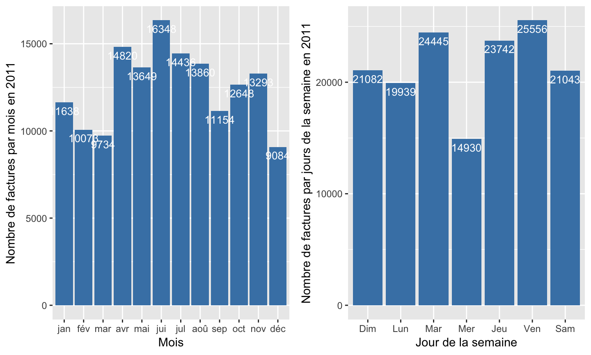
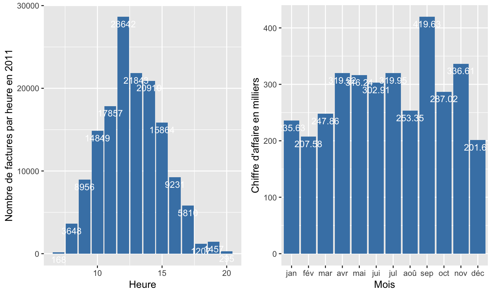
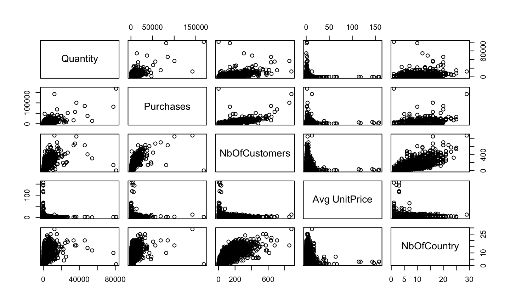
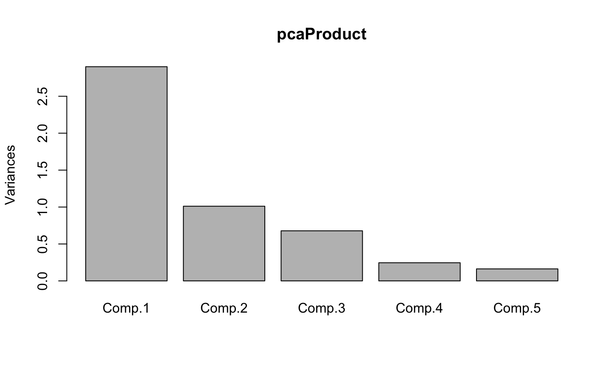
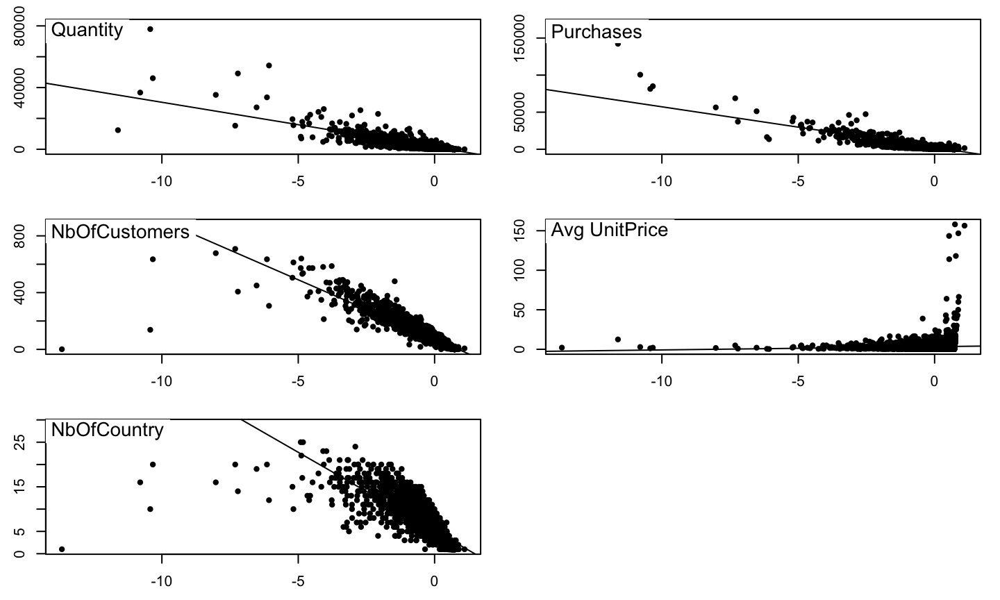
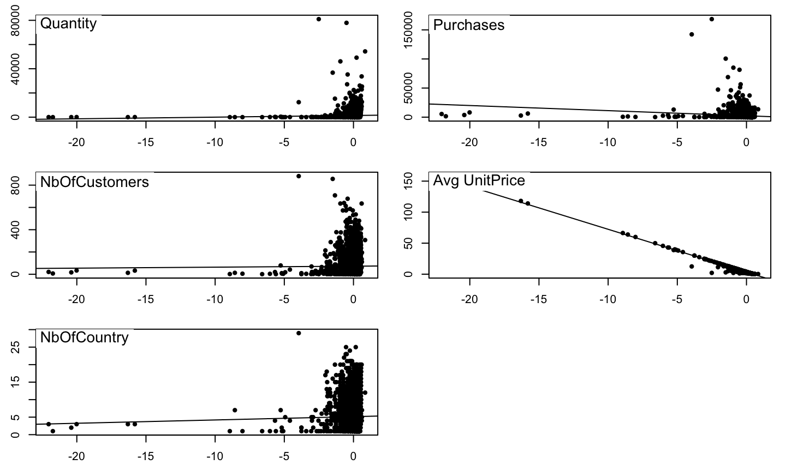
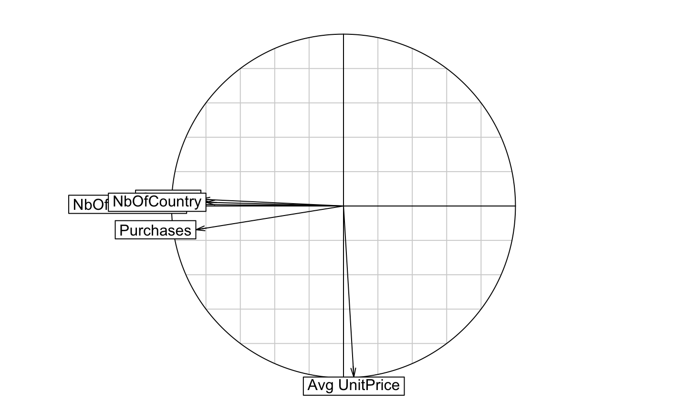
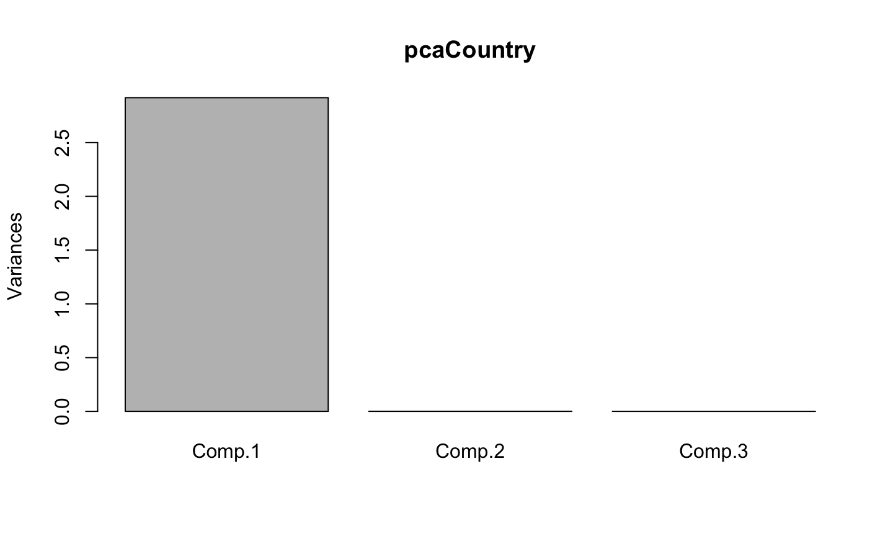

## Plan
1. Introduction
2. Exploration du Dataset
3. Statistiques descriptives
4. Analyse des composantes principales (ACP)
5. Clustering
6. Bonus

## 1. Introduction 
Le dataset contient toutes les factures émise par un magasin en ligne basé en Angleterre. Le magasin vends des cadeaux uniques pour toutes les occasions.

Le dataset contient: nb de lignes

```
    InvoiceDate
1 1/12/10 08:26
2 1/12/10 08:26
3 1/12/10 08:26
4 1/12/10 08:26
5 1/12/10 08:26
```

```
         InvoiceDate
541905 9/12/11 12:50
541906 9/12/11 12:50
541907 9/12/11 12:50
541908 9/12/11 12:50
541909 9/12/11 12:50
```

Couvrant la période: head et tail

## Exploration des données dans le Dataset 
### Nombre d'enregistrements

```
[1] 541909
```

### Les différentes variables

```
[1] "InvoiceNo"   "StockCode"   "Description" "Quantity"    "InvoiceDate"
[6] "UnitPrice"   "CustomerID"  "Country"    
```


## Exploration du Dataset
### Nombre de pays différents

```
[1] 38
```

### Nombre clients

```
[1] 4373
```
### Nombre de factures

```
[1] 25900
```

## Facture annulées

## StockCode POST, D, ...

## Nettoyage du dataset
### Suppression des données inutiles


```
541909 lignes à la base
```

```
396337 lignes après nettoyage
```

```
Pourcentage retiré : 26.86281 %
```

## Statistique descriptive

### Visualisation des données

```
Nombre de factures (uniques): 25900
```

```
Nombre de produits (uniques): 4070
```

```
Nombre de clients (uniques): 4373
```

```
Nombre de pays: 38 Attention 37 + undefined
```

```
Summary des quantités 
```

```
     Min.   1st Qu.    Median      Mean   3rd Qu.      Max. 
-80995.00      1.00      3.00      9.55     10.00  80995.00 
```

## Statistique descriptive
### Quelques graphs (1/2)


## Statistique descriptive
### Quelques graphs (2/2)


## ACP produits
### Pairs


## ACP produits
### Cor

```
                 Quantity Purchases NbOfCustomers Avg UnitPrice
Quantity       1.00000000 0.7474641    0.61811828   -0.08826218
Purchases      0.74746408 1.0000000    0.68451970    0.04854800
NbOfCustomers  0.61811828 0.6845197    1.00000000   -0.05353721
Avg UnitPrice -0.08826218 0.0485480   -0.05353721    1.00000000
NbOfCountry    0.45721675 0.4889382    0.78839734   -0.04236737
              NbOfCountry
Quantity       0.45721675
Purchases      0.48893816
NbOfCustomers  0.78839734
Avg UnitPrice -0.04236737
NbOfCountry    1.00000000
```

## ACP produits
### Summary

```
Importance of components:
                          Comp.1    Comp.2    Comp.3    Comp.4     Comp.5
Standard deviation     1.7030522 1.0056865 0.8236076 0.4957014 0.40347502
Proportion of Variance 0.5802359 0.2023364 0.1357030 0.0491574 0.03256732
Cumulative Proportion  0.5802359 0.7825723 0.9182753 0.9674327 1.00000000
```

## ACP produits
### Plots


## ACP produits
### Ade4


## ACP produits
### Ade4


## ACP produits
### Ade4


## ACP pays
### Pas intéressant

